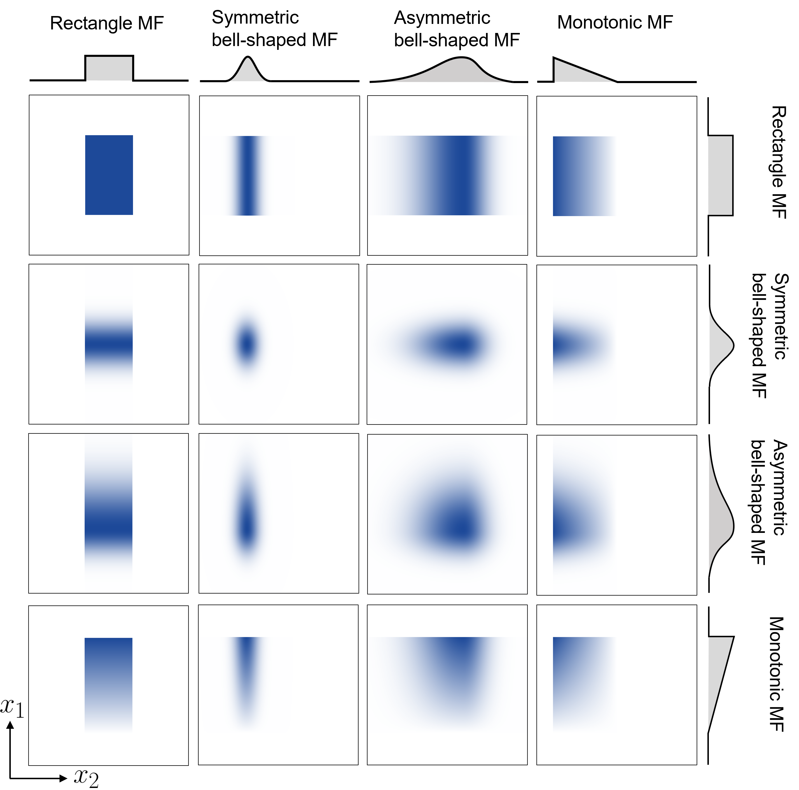
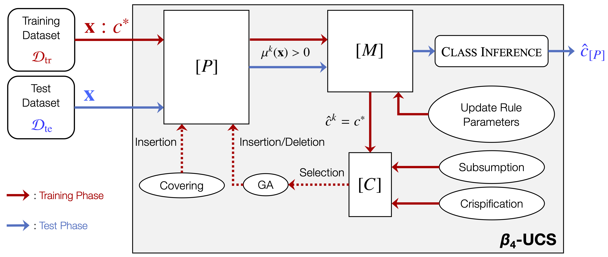

# $\beta_4$-UCS: a Learning Classifier System with Adaptive Rule Representation <!-- omit in toc -->


Julia implementation of $\beta_4$-UCS from our IEEE Transactions on Evolutionary Computation (TEVC) article:

>Hiroki Shiraishi, Yohei Hayamizu, Tomonori Hashiyama, Keiki Takadama, Hisao Ishibuchi, and Masaya Nakata. 2025. **Adapting Rule Representation With Four-Parameter Beta Distributions for Learning Classifier Systems**. IEEE Transactions on Evolutionary Computation, Early Access (March 2025). https://doi.org/10.1109/TEVC.2025.3550915


## What is $\beta_4$-UCS?




$\beta_4$-UCS is an evolutionary rule-based machine learning system (a.k.a. [Learning Classifier Systems](https://en.wikipedia.org/wiki/Learning_classifier_system) <sup><a id="ref1"></a>[[1]](#1)</sup>) that enables each rule to flexibly adapt between crisp intervals and fuzzy boundaries using a four-parameter beta distribution, as shown above. This approach allows the system to automatically select the most appropriate rule representation for each region of the input space, evolving simple, interpretable crisp rules where possible and retaining fuzzy rules only where necessary for complex or noisy boundaries. $\beta_4$-UCS employs evolutionary operators and a generalization pressure mechanism – including a crispification operator inspired by Ockham’s Razor – to promote model simplicity and interpretability without sacrificing predictive performance.

$\beta_4$-UCS draws its inspiration from UCS <sup><a id="ref2"></a>[[2]](#2)</sup>, the most successful Michigan-style Learning Classifier System, and its fuzzy extension, Fuzzy-UCS <sup><a id="ref3"></a>[[3]](#3)</sup>. The design philosophy behind $\beta_4$-UCS builds upon these foundational frameworks while introducing novel adaptive rule representation mechanisms. For Julia implementations of both UCS and Fuzzy-UCS, please refer to our repository linked [here](https://github.com/YNU-NakataLab/jUCS).

## Brief Algorithm of $\beta_4$-UCS



A schematic illustration of $\beta_4$-UCS is shown above. The run cycle depends on the type of run: training or test. During the training phase, $\beta_4$-UCS searches for an accurate and maximally general ruleset, $[P]$, using a training dataset, $\mathcal{D}_{\rm tr}$. During the test phase, $\beta_4$-UCS applies $[P]$ to infer a class for a new unlabeled data point, $\mathbf{x}$.

### Training Phase

- **Initialization**: The rule population is initialized empty. As training samples are presented, rules are created to ensure all regions of the input space are covered.
- **Rule Matching and Update**: For each input, rules are matched using their beta-distribution-based membership functions. Matching rules are updated for experience, fitness, and class support.
- **Genetic Search**: When triggered, genetic operators (crossover and mutation) evolve rule parameters, $\alpha, \beta, l, u$, enabling adaptation of both the shape and fuzziness of rule boundaries.
- **Subsumption and Crispification**: Generalization pressure is applied through subsumption (removing redundant rules) and the crispification operator, which converts sufficiently accurate fuzzy rules into crisp ones, in line with Ockham’s Razor.
- **Population Control**: The population size is managed by deleting less useful rules as needed.
  
### Test Phase

- **Prediction**: For each test input, rules are matched and their predictions are aggregated using a weighted voting scheme, where each rule’s vote is weighted by its fitness, match degree, and numerosity.
- **Decision-Making**: The class with the highest aggregated vote is selected as the system’s prediction for the input (i.e., voting-based inference <sup><a id="ref4"></a>[[4]](#4)</sup>).


## Setup and Usage Guide
### Requirements
* Julia v1.11.1 or higher (download [here](https://julialang.org/downloads/#official_binaries_for_manual_download))
* Packages: ArgParse,
    CategoricalArrays,
    CSV,
    DataFrames,
    Distributions,
    MLJ,
    Special Functions,
    Suppressor

### Installation
Once Julia is installed, you can install the required Julia packages with the following command via the command line interface.
```bash
julia packages.jl
```

### Usage
You can train a $\beta_4$-UCS model using any tabular dataset (e.g., yourfile.csv) for classification via the command line interface. Note that:
- The rightmost column of the CSV file must represent the class label, while all other columns should constitute the input features.
- Class labels must be integers starting from 0 (e.g., 0, 1, 2) for proper processing.
- Any missing values in the dataset should be represented by a question mark (?).
- Ensure that the CSV file does not contain a header row; the data should start from the first line.


Here are examples of how to run the model:

#### Run $\beta_4$-UCS
```bash
julia ./beta4-ucs/main.jl --csv=yourfile.csv
```

#### For Further Details
```bash
julia ./beta4-ucs/main.jl --help
```


### Output Examples
Upon completion of the experiment, $\beta_4$-UCS generates the following files: 
- [`summary.csv `](#summarycsv)
- [`classifier.csv`](#classifiercsv-fuzzy-ucs)
- [`parameters.csv`](#parameterscsv-fuzzy-ucs)
- [`time.csv`](#timecsv)

#### `summary.csv`
$\beta_4$-UCS tracks the following features every epoch:

* Iteration (`Iteration`): The number of training instances used up to the epoch
* Average Training Accuracy (`TrainAcc`): Classification accuracy on the training dataset
* Average Testing Accuracy (`TestAcc`): Classification accuracy on the testing dataset
* Average Training Precision (`TrainPre`)
* Average Testing Precision (`TestPre`)
* Average Training Recall (`TrainRec`)
* Average Testing Recall (`TestRec`)
* Average Training Macro-F1 (`TrainF1`)
* Average Testing Macro-F1 (`TestF1`)
* Average Macropopulation Size (`PopSize`): The number of rules in the population
* Occurrence Rate of the Covering Operation (`%Covering`)
* Number of the Subsumption Operation (`#Subsumption`)

These values are saved as `summary.csv`. An example of log output during the experiment is shown below.

```
          Epoch    Iteration     TrainAcc      TestAcc     TrainPre      TestPre     TrainRec      TestRec      TrainF1       TestF1      PopSize    %Covering #Subsumption
============ ============ ============ ============ ============ ============ ============ ============ ============ ============ ============ ============ ============
           1         5400       47.315       46.167       47.184       47.350       39.164       38.287       41.977       41.311          473        0.013            0
           2        10800       49.296       48.000       49.133       49.479       25.104       24.243       33.118       32.481          960        0.009            4 
           3        16200       66.407       63.833       66.310       64.804       69.556       66.911       63.163       60.534         1227        0.057           10 
           4        21600       80.907       80.333       80.887       80.513       80.843       80.404       80.651       80.389         1302        0.021          131 
           5        27000       84.333       84.000       84.312       84.145       84.217       84.127       84.238       84.118         1424        0.007          107 
           6        32400       86.556       85.333       86.534       85.471       86.476       85.402       86.439       85.421         1432        0.005          123 
           7        37800       87.481       87.000       87.461       87.131       87.411       87.001       87.343       87.046         1442        0.006          168 
           8        43200       87.944       87.000       87.931       87.133       87.949       87.080       87.807       86.987         1442        0.003          117 
           9        48600       88.185       87.167       88.176       87.267       88.199       87.223       88.091       87.241         1431        0.004          263 
          10        54000       88.389       86.833       88.378       86.991       88.485       86.940       88.300       86.857         1427        0.004          245 
          11        59400       88.704       88.500       88.691       88.615       88.703       88.552       88.625       88.546         1348        0.007          266 
          12        64800       89.500       89.500       89.484       89.710       89.456       89.489       89.413       89.538         1397        0.008          276 
          13        70200       89.630       89.333       89.614       89.490       89.592       89.334       89.530       89.371         1395        0.005          281 
          14        75600       89.537       89.167       89.523       89.324       89.486       89.165       89.451       89.213         1389        0.006          294 
          15        81000       89.815       88.667       89.803       88.757       89.774       88.744       89.744       88.725         1375        0.009          341 
          16        86400       89.685       89.500       89.668       89.680       89.685       89.496       89.554       89.532         1401        0.009          300 
          17        91800       89.519       90.000       89.505       90.117       89.506       90.002       89.420       90.041         1403         0.01          293 
          18        97200       89.907       89.333       89.890       89.533       89.842       89.339       89.809       89.371         1374         0.01          326 
          19       102600       90.148       90.500       90.133       90.612       90.129       90.578       90.057       90.584         1380         0.01          317 
          20       108000       91.111       90.500       91.097       90.629       91.086       90.555       91.036       90.557         1340        0.009          326
```

#### `classifier.csv`

A $d$ -dimensional rule (a.k.a. classifier) $k$ is represented by the :

```math
{\rm \textbf{IF}} \; x_1 \; \text{is} \; A_1^k \; \text{and} \; \cdot\cdot\cdot\; \text{and} \; x_d \; \text{is} \; A_d^k \; {\rm \textbf{THEN}} \; \hat{c}^k,
```

where

- Rule-Antecedent (IF part) $\mathbf{A}^k=(A_1^k,..., A_d^k)$: 
  - Determines whether the rule matches a given input
  - $x_i$ is conditioned by $A_i^k=(\alpha_i^k,\beta_i^k,l_i^k,u_i^k)$, where $(\alpha_i^k,\beta_i^k)$ and $(l_i^k,u_i^k)$ correspond to the shape and interval parameters of the four-parameter beta distribution, respectively
    - $\alpha_i^k=\beta_i^k=1$: $A_i^k$ becomes a rectangular membership function, representing a crisp interval, $[l_i^k,u_i^k]$
      - **NOTE:** If $l_i^k$ and $u_i^k$ are such that $l_i^k\leq 0$ and $u_i^k\geq 1$ (i.e., the interval exceeds the domain bounds), $A_i^k$ is equivalent to *Don't Care* or #, indicating that any value is acceptable for that attribute
    - $\alpha_i^k=\beta_i^k>1$: $A_i^k$ becomes a symmetric bell-shaped membership function.
    - $\{\alpha_i^k \neq 1,\beta_i^k=1\}$ or $\{\alpha_i^k = 1,\beta_i^k\neq1\}$: $A_i^k$ becomes a monotonic function (i.e., a right-angled triangular shape)
    - $\alpha_i^k \neq \beta_i^k$ and $\alpha_i^k,\beta_i^k>1$: $A_i^k$ forms an asymmetric bell-shaped membership function  
- Rule-Consequent (THEN part) $c^k\in\mathcal{C}$: 
  - Indicates the class that the rule predicts
  - $\mathcal{C}\in\{c_i\}_{i=1}^n$ is a class label set (i.e., for $n$-class classification)
-  Rule-Weight (WITH part) $w^k\in[0,1]$:
   -  Denotes the confidence or certainty with which the rule predicts the class

Each rule $k$ has the following book-keeping parameters:
- Weight Vector $\mathbf{v}^k\in[0,1]^n$:
  - Indicates the confidence with which the rule predicts each class for a matched input
- Fitness $F^k\in(-1,1]$:
  - Reflects the classification accuracy of the rule
- Experience ${\rm exp}^k\in\mathbb{R}^+_0$:
  - Computes the accumulated contribution of the rule in order to classify training data points
- Correct Matching Vector $\mathbf{cm}^k\in(\mathbb{R}^+_0)^n$:
  - Each element is the summation of the membership degree for training data points from the corresponding class
- Correct Set Size ${\rm cs}^k\in\mathbb{R}^+$:
  - Averages the sizes of the correct sets in which the rule has participated
- Time Stamp ${\rm ts}^k\in\mathbb{N}$:
  - Denotes the time-step of the last execution of the GA to create new rules, where the rule was considered as a candidate to be a parent
- Numerosity ${\rm num}^k\in\mathbb{N}_0$:
  - Indicates the number of rules that have been subsumed

The acquired population is saved as `classifier.csv` as shown below.

|Classifier|Antecedent (#; [lower,upper]; (alpha,beta,lower,upper);)|Consequent|Weight|Weight Vector|Fitness|Experience|Correct Matching Vector|Correct Set Size|Time Stamp|Numerosity|
|:----|:----|:----|:----|:----|:----|:----|:----|:----|:----|:----|
|60924|[0.0,0.687], [0.0,0.023], [0.215,0.233]|3|1|[0.0, 0.0, 0.0, 1.0]|1|34|[0.0, 0.0, 0.0, 34.0]|7.676470588|266477|3|
|146475|#, [0.184,0.303], [0.328,0.377]|2|1|[0.0, 0.0, 1.0, 0.0]|1|1356|[0.0, 0.0, 1356.0, 0.0]|64.90781711|269953|2|
|161645|[0.209,0.577], [0.0,0.104], [0.149,0.326]|2|1|[0.0, 0.0, 1.0, 0.0]|1|328|[0.0, 0.0, 328.0, 0.0]|39.60365854|269982|3|
|162186|(1.0,1.425,-0.451,0.611), [0.0,0.023], [0.215,0.233]|3|1|[0.0, 0.0, 0.0, 1.0]|1|7.064256331|[0.0, 0.0, 0.0, 7.064256331169588]|9.2|266477|2|
|167490|#, [0.092,0.303], [0.335,0.36]|2|1|[0.0, 0.0, 1.0, 0.0]|1|627|[0.0, 0.0, 627.0, 0.0]|66.87719298|269953|3|


#### `parameters.csv`
$\beta_4$-UCS has the following hyperparameters:
- $N$ (`N`): Maximum population size
- $F_0$ (`F0`): Fitness threshold
- $\nu$ (`nu`): Fitness exponent
- $\chi$ (`chi`): Crossover probability
- $p_{\rm mut}$ (`mu`): Mutation probability
- $\delta$ (`delta`): Fraction of mean fitness for rule deletion
- $\theta_{\rm GA}$ (`theta_GA`): Time threshold for GA application in a correct set
- $\theta_{\rm del}$ (`theta_del`): Experience threshold for rule deletion
- $\theta_{\rm sub}$ (`theta_sub`): Experience threshold for subsumption
- $\theta_{\rm exploit}$ (`theta_exploit`): Experience threshold for class inference
- $\tau$ (`tau`): Tournament size
- $P_\\#$ (`P_hash`): Probability of *Don't Care* condition in covering
- $m_0$ (`m_0`): The maximum change of a lower value or a upper value in mutation
- $r_0$ (`r_0`): Maximum range in covering
- ${\rm Tol}_{\rm sub}$ (`tol_sub`)
- $doGASubsumption$ (`doGASubsumption`): Whether GA subsumption is performed
- $doCorrectSetSubsumption$ (`doCSSubsumption`): Whether correct set subsumption is performed
- $doCorrectSetCrispification$ (`doCSCrispification`): Whether correct set crispification is performed


The used hyperparameter values are saved as `parameters.csv` as shown below.
|Parameter|Value|
|:----|:---:|
|N|2000|
|F0|0.99|
|nu|1|
|chi|0.8|
|mu|0.04|
|delta|0.1|
|theta_GA|50|
|theta_del|50|
|theta_sub|50|
|theta_exploit|10|
|tau|0.4|
|P_hash|0.33|
|m0|0.1|
|r0|1|
|tol_sub|0.01|
|doGASubsumption|TRUE|
|doCSSubsumption|TRUE|
|doCSCrispification|TRUE|


#### `time.csv`
The runtime (sec.) is saved as `time.csv` as shown below.
```
53.364
```

### Description of the $\beta_4$-UCS Files
#### `./beta4-ucs/ucs.jl`
This file implements the core components of the $\beta_4$-UCS algorithm. It includes:
- The main $\beta_4$-UCS structure
- Functions for generating match and correct sets
- Methods for updating classifier parameters
- Procedures for running the genetic algorithm
- Routines for handling population management

#### `./beta4-ucs/classifier.jl`
This file defines the B4Classifier struct and associated methods for $\beta_4$-UCS. It includes:
-  Constructor for creating new B4Classifiers
-  Methods for matching B4Classifiers to input states
-  Functions for modifying B4Classifiers through crossover and mutation
-  Comparison operations to check generality and equality between B4Classifiers
  
#### `./beta4-ucs/condition.jl`
This file implements the Four-Parameter Beta Distribution-Based Representation (FBR) for classifier conditions in $\beta_4$-UCS. It includes:
* A struct definition for FBR objects
* Functions for getting a FBR membership degree against a given input
* Methods for comparing equality between FBR objects
* Initialization functions for creating new FBR objects

#### `./beta4-ucs/parameters.jl`
This file defines the hyperparameters for $\beta_4$-UCS. It includes:
-  A mutable struct called Parameters that encapsulates all hyperparameters for the algorithm
-  A constructor function to initialize the Parameters struct from command-line arguments
-  Definitions for key algorithm parameters such as population size, mutation probability, and various thresholds

#### `./beta4-ucs/helper.jl`
This file implements helper functions for $\beta_4$-UCS. It includes:
-  Methods for data output and management
-  Functions for generating classifier lists
-  Routines for creating parameter lists
-  Various performance evaluation functions
-  A inference function for classification tasks

#### `./beta4-ucs/main.jl`
This file implements the main execution logic for the $\beta_4$-UCS algorithm. It includes:
-  Command-line argument parsing for experiment configuration
-  Setup for single or multiple dataset experiments
-  Implementation of training and testing phases
-  Result output and data logging functionality

#### `./environment/real_world.jl`
This file implements an Environment struct and associated functions for handling real-world classification problems. It includes:
* Functions for loading and preprocessing data from CSV files
* Methods for data normalization and shuffling
* Helper functions for managing dataset properties and statistics

#### `./packages.jl`
This file adds a list of required package dependencies to the project using the Pkg module.

#### `./dataset`
This folder contains 25 datasets used in the main article

## Reproducing Article Results
To reproduce the results from the article:
```bash
julia ./beta4-ucs/main.jl --all=true
```

This code will run experiments on the 25 datasets used in the article and output results.

## Copyright

The copyright of $\beta_4$-UCS belongs to the authors in the [Evolutionary Intelligence Research Group](http://www.nkt.ynu.ac.jp/en/) (Nakata Lab) at Yokohama National University, Japan. You are free to use this code for research purposes. In such cases, we kindly request that you cite the following article:

>Hiroki Shiraishi, Yohei Hayamizu, Tomonori Hashiyama, Keiki Takadama, Hisao Ishibuchi, and Masaya Nakata. 2025. **Adapting Rule Representation With Four-Parameter Beta Distributions for Learning Classifier Systems**. IEEE Transactions on Evolutionary Computation, Early Access (March 2025). https://doi.org/10.1109/TEVC.2025.3550915

```bibtex
@article{shiraishi2025adapting,
  title={Adapting Rule Representation With Four-Parameter Beta Distribution for Learning Classifier Systems},
  author={Shiraishi, Hiroki and Hayamizu, Yohei and Hashiyama, Tomonori and Takadama, Keiki and Ishibuchi, Hisao and Nakata, Masaya},
  journal={IEEE Transactions on Evolutionary Computation},
  year={2025},
  publisher={IEEE},
  doi={10.1109/TEVC.2025.3550915}
}
```


## References

<a id="1"></a>
[1] Ryan J. Urbanowicz and Will N. Browne. **Introduction to learning classifier systems**. Springer, 2017. https://books.google.co.jp/books?id=C6QxDwAAQBAJ [[↑]](#ref1) 

<a id="2"></a>
[2] Ester Bernadó-Mansilla and Josep M. Garrell-Guiu. "**Accuracy-based learning classifier systems: models, analysis and applications to classification tasks**." Evolutionary Computation 11.3 (2003): 209-238. https://doi.org/10.1162/106365603322365289 [[↑]](#ref2)  

<a id="3"></a>
[3] Albert Orriols-Puig, Jorge Casillas, and Ester Bernadó-Mansilla. "**Fuzzy-UCS: a Michigan-style learning fuzzy-classifier system for supervised learning**." IEEE Transactions on Evolutionary Computation 13.2 (2008): 260-283. https://doi.org/10.1109/TEVC.2008.925144 [[↑]](#ref3)   

<a id="4"></a>
[4] Andras Bardossy and Lucien Duckstein. **Fuzzy rule-based modeling with applications to geophysical, biological, and engineering systems**. CRC press, 1995. https://doi.org/10.1201/9780138755133 [[↑]](#ref4)  
